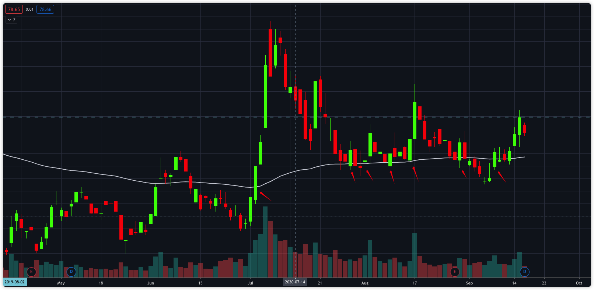

# Assignment

- Week 1 - Warm Up:
    1. How git works and why it is crucial to learn git.
    2. First glimpse on Financial data for China Equity.
    3. First step to build a workable data pipeline.

- Assignment:
    1. Get yourself familiar with TuShare API and datasets.
    2. Get yourself familiar with git version control.
    3. Create a function to get hs300 stock dataframe and store it under /data/universe/ as csv
    4. Given a universe file, create a function to get daily stock price data and store them to /data/daily_price as csv
        - data of past 5 years is desirable
    5. Now you have stock price data of past 5 years, but you need a function to update them on daily base. Please create a function to update the files.
        - Please do not repeat previous steps to get full data, as getting 5-year data daily from API is slow and not optimal. 
        - There are several ways you could update the data, just pick up one that works for you.
    
- Bonus point:
    - How to check whether new data is loaded on server side before updating?
    - Be aware to avoid hard-coded parameters, such as date.
    - Get an idea of how long it takes to update data on daily base. 
    - How to deal with stock split, dividend, etc..

---

Week 2 - Build your trading signal(1):
##### In this week, you will learn to build a trading signal based on the data you gathered in week 1.
##### You may encounter several issues and you need to make sensible decisions in order to move forward.
##### Good luck!

- What we will cover:
    - what is MA/EMA, and in general how traders trade on it.
    - Extract EMA signals from data.
    - Calculate returns from data.
    - Combine to a panel data for further analysis.

- Signals we would like to capture:
    

- Assignment:
    1. Understand what is MA and how it works.
        - https://www.investopedia.com/articles/active-trading/052014/how-use-moving-average-buy-stocks.asp#:~:text=The%20moving%20average%20(MA)%20is,time%20period%20the%20trader%20chooses.
    2. Understand what is EMA, and then install ta-lib package, use it to get EMA with price data.
        - https://github.com/mrjbq7/ta-lib
        - if ta-lib doesn't work on your computer, which happens time to time, you will have to calculate MA by yourself.
    3. Pick 中国平安 as example, calculate and append **EMA100** values
    4. Based on below conditions, create a new column called 'score_ema_100', in which value equals to 1 if signal detected, otherwise 0.
        - condition: (low <= EMA100) & (close >= EMA100) for a single day price
    5. Calculate and append return data
        - return calculation: t+x_return = ((t+x_close - t+1_open) / t+1_open) - 1
        - x = range(1,10)
    6. Combine price data, signal data, return data to a panel data, which will be used for further analysis.
        - I will show you an example of how it should look like.
    

---

Week 3 - Build your trading signal(2):
##### Last week, you built your first trading signal based on moving average, and applied it to ticker 601318.
##### This week, we will evaluate the signal.

- Assignment:
    1. Plot the return distribution. You could use Jupyter notebook.
    2. Calculate metrics
        - signal breath: number of time signal detected per month/year.
        - win rate: percentage of time signal produces positive return
        - biggest drawback: biggest negative return
        - avg return: average return
    3. Write a reusable class for step 2 and each metrics should be a method in the class.
    4. (extra) You can break down above metrics by year, month, to get more informed insight.
    5. (extra) You can also visualize the result by plotting. We will not cover visualization topics for now.
    
---

Week 4 - Visualization and new signal:
##### This week, You will recap what you learned in previous weeks, and apply to a similar strategy.
##### You will also explore to write some utility functions that will help you visualize the data.

**Please be noticed that, start from this week, I will not explicitly tell you what to do. I will give you a direction, and you will figure out the details.
But you should feel free to ask any questions if you are not sure.**

- Assignment:
    - Apply to what you learned to apply to MA Crossover signal
        - figure out what is MA crossover, and how it works
        - Design your MA crossover signal
        - Send me your designs
        - start coding up the signal
        - Evaluate it
        
    - write a function to plot candle stick charts
        - input param: df, time range
        - output: a candle stick chart
        
    - Scale contents of week2&3 to the HS300 universe.
        - Apply the contents to HS 300. Simply a for loop.
        - Save it to a fairly structured folders.

Week 5 - Alternative data:
##### Investors gradually realize alpha decays fast. If investors only incorporate traditional data, it is difficult to generate alpha.
##### So Alternative data become increasingly important.

- Assignment:
    1. Figure out what is North Money, South Money
    2. Find the api from tushare
    3. get the data for past 5 years
    4. Get some statistics:
        - How many unique names per year
        - How often those names show up on the list
    5. Mapping the names and trading volumes to the candle sticks plot you draw last week.
    6. Do you see anything interesting?
    7. figure out a way to store the output
        - You may want to store statistics in text file, or html file, or sending me daily email on a trading day.
        - How to store the plots? If use notebook, Is it too slow to open? How about store graphs to local drive.
    

Week 6 - A real case study: Streamline your workflow for reporting
##### You are working for a tech department. One of your works is to provide market report daily to Fundamental PM.
##### The PM would like to have a daily report on his/her desk one hour after market close everyday.
##### You would like to streamline your workflow to get it done, so you can set yourself free for other tasks.

- To simplify the task for you, lets use the requirements below:
    - PM needs a description of the company that triggers our trading signal.
    - PM needs a quick view of candle and volume charts of the company.
    - PM would like to receive an email which contains all information.

- Assignment:
    - Make a folder and put in price data file of 5 stocks that is well known
    - code the logic for updating data daily
    - code the logic to send 5 emails with below information
        - Subject: Daily report for [ticker] on [date]
        - Information of the company
        - North data information
        - MA signal information

- What to expect:
    - Running a simple "daily_report_gen.py" in cmd
    - The py script will get all things done.

Week 7 - Capstone 1: build your smart beta portfolio
- Assignment:
    1. Understand what is beta, and what is smart beta
    2. Construct a portfolio by using the companies recorded in north money.
        - The construction process can be very flexible. I will list up some assumptions, but feel free to change or add more.
            - how to pick up the company: mentioned? net-inflow? for how many days?
            - How to decide the weights in portfolio?
            - Do you want to actively manage the portfolio?
        - Please come up with an assumption and a plan, and lets have a review before moving forward.
    3. Track its performance
    4. Compare it to benchmark HS300
    5. Plot it the equity curve. 
    6. Draw a conclusion on your assumption.

Week 8 - Wrap up report
- Assignment:
    - To write a report on the strategy/portfolio
        - sensibility
        - how you construct the strategy, and how you make decisions
        - Visualize the mid-result/final result
        - The criteria is clear logic and easy to follow

